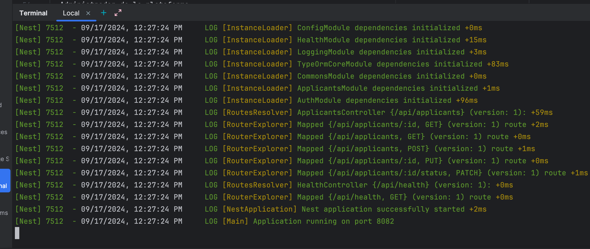
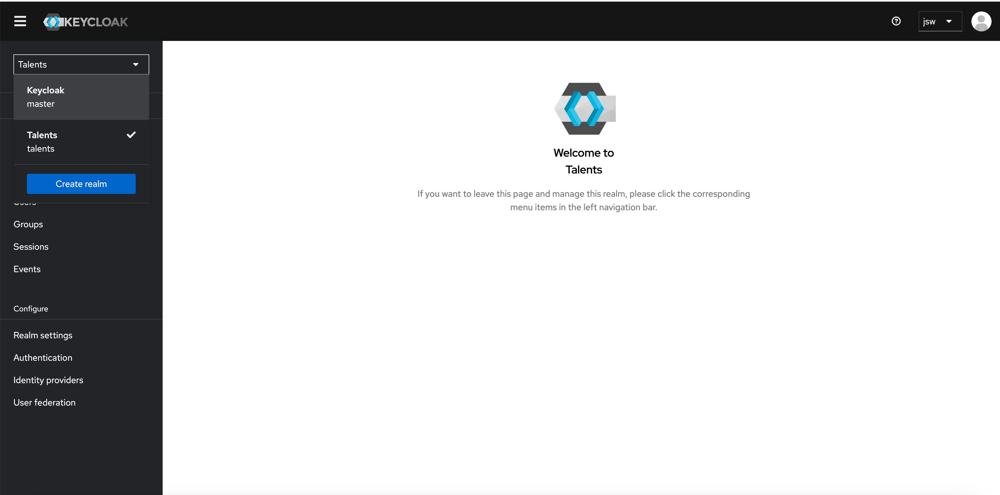
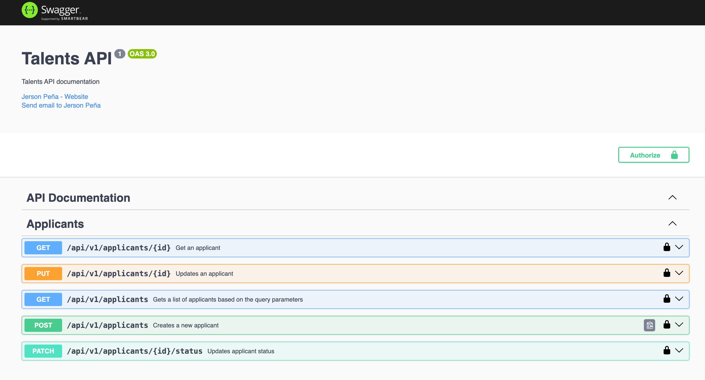
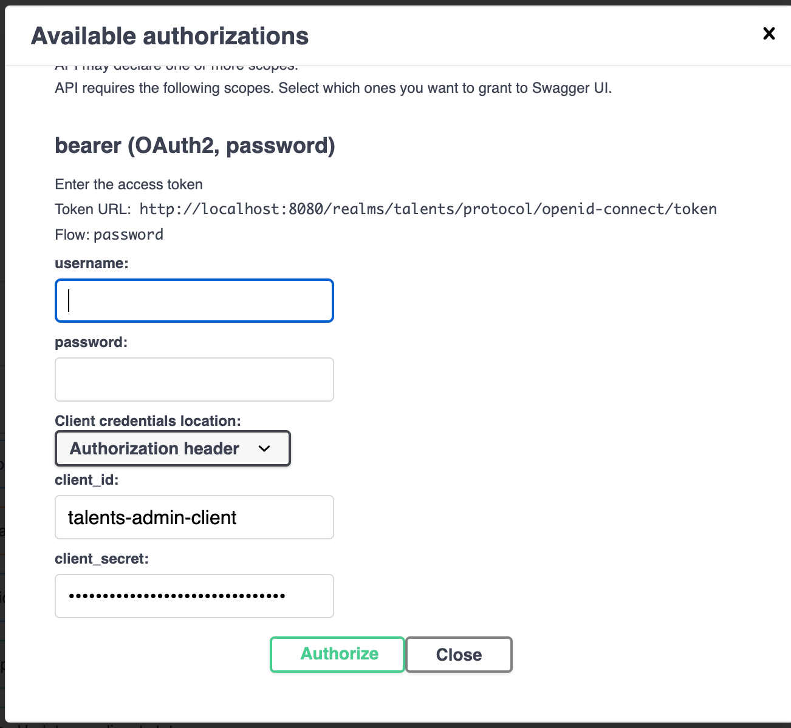

## Talents API

### Descripción

`Talents` is a `RESTful API` designed for Human Resource professionals to register and manage resumes, built with NestJS and adhering to the principles of Hexagonal Architecture.

### Tech Stack

- **NestJS**: A progressive Node.js framework for building efficient, reliable and scalable server-side applications.
- **Keycloak**: An open-source Identity and Access Management solution aimed at modern applications and services.
- **PostgreSQL**: A powerful, open-source object-relational database system.
- **Docker**: A platform for developing, shipping, and running applications using containerization.
- **TypeORM**: An ORM that can run in NodeJS and can be used with TypeScript and JavaScript.
- **Swagger**: A tool for documenting APIs and testing them.

### What do you need to run this project?
- Docker **20.10.12+**
- Docker Compose **3.8+**
- NodeJS **20.15.0+**

### How to run this project?

1. **Clone the repository**: 
```bash
$ git clone https://github.com/jersonsw/talents-api.git && cd talents-api
```

2. **Install the dependencies**:
  ```bash
  $ npm install
  ```

3. **Bootstrap the infrastructure**:
  ```bash
  $ npm run infra:up
  ```

   #### _This command will do the following things:_
   1. Install and create the container for Keycloak's database (PostgreSQL).
   2. Install and create the container for API's DB (Also PostgreSQL).
   3. Create the DB structure by running the TypeORM migrations.
   4. Create the initial user data in Keycloak.


4. **Optionally, you can run `npm run seed:run` in a separate console tab if you want to run the seeders, so that you can have initial data to play with**.

5. **Run the API**:

  ```bash
  $ npm run start:dev
  ```

### How to know if everything is running correctly?
1. You'll see your console similar to the below screenshot, which is a good sign because that would mean API ran expected so the DB too, otherwise you'd see an error message from Nest retrying to connect to the DB:



2. You can access Keycloak's admin console by going to `http://localhost:8080` and logging in with the credentials `jsw:hello123++`. You'll see the following UI:

The realm called **Talents** should be already appearing in the dropdown.

3. You can access the API documentation by going to `http://localhost:8082/docs`. Once there you should be able to see the following UI: 



4. Also, you can ensure that everything is running fine by running `docker ps` in the console to confirm that the following 3 containers are up & running:
   - `talents-keycloak`
   - `talents-api-keycloak-db`
   - `talents-api-db`

### How to access the API?

Now that everything is up and running the next step is to try the API. You can use the following credentials to access the API:
- `admin`/`pass`
- `hr_manager`/`pass`
- `hr_recruiter`/`pass`

Even though everything is set to only work with OAuth2 + OpenID Connect + PKCE, which implies the ussage of the Authorization Code flow, to be able to test the API smoothly, I've set Keycloak to allow Password Grant flow for the above users.

So to start testing the API, you just need to access Swagger Docs and click on the `Authorize` button, then you'll see a modal where you can input the credentials of one of the above users, and then you'll be able to test the API.


As you can see in the above image, the client id and secret are prefilled, so you just need to input the username and password of one of the above users.

### How to stop the project?
```bash
# If you just want to stop the containers
$ npm run infra:stop

# If you want to stop the containers and remove the volumes
$ npm run infra:down
```

And that's it! You have successfully run the project. If you have any questions or suggestions, feel free to reach out to me.

## Author

[Jerson Peña](https://github.com/jersonsw)

